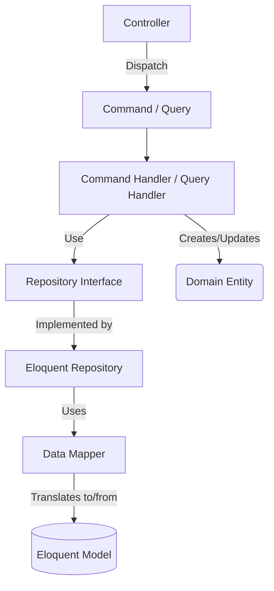

# Refactorización DDD (Fase 2) - Puertos, Adaptadores y CQRS Completado

¡Hemos implementado con éxito la Fase 2 de la arquitectura para todos los Bounded Contexts!

> [!TIP]
> Todas las tareas marcadas como completadas están en el [Tracker de Tareas](file:///home/robypz/.gemini/antigravity-ide/brain/5a747fb5-5c58-49e6-bc6c-2627fe8b4f0d/task.md).

## Arquitectura Implementada

### 1. Capa de Dominio (Puertos)
Hemos añadido las **Interfaces de Repositorio** (ej. `UserRepositoryInterface`) para todos los Aggregate Roots principales. Estas interfaces definen los contratos para `save()` y `findById()`, garantizando que el dominio sigue siendo completamente independiente de MongoDB o Eloquent.

### 2. Capa de Infraestructura (Adaptadores y Mappers)
Hemos implementado las interfaces del dominio utilizando **Repositorios de Eloquent**.
Para mantener el Dominio limpio, implementamos el patrón **Data Mapper**.
- **DataMappers**: Clases como `UserDataMapper` se encargan de traducir los Modelos Eloquent provenientes de `app/Models` en `Entidades` de dominio usando `Value Objects`.
- **Persistencia**: Los Repositorios (ej. `EloquentUserRepository`) se encargan de buscar el modelo subyacente, mapearlo o persistir los datos mutados de vuelta a MongoDB.

### 3. Capa de Aplicación (CQRS)
Se construyó la base del sistema CQRS con Comandos y Consultas segregados.
- **Commands**: Se crearon objetos DTO (ej. `CreateUserCommand`) sin lógica, solo datos primitivos recibidos de la vista/API.
- **Command Handlers**: Se implementaron Handlers (ej. `CreateUserCommandHandler`) que orquestan el caso de uso: generan IDs, instancian Value Objects, crean la Entidad de Dominio y finalmente la persisten a través de las interfaces de Repositorio (Inyección de Dependencias).
- **Queries**: Ejemplos básicos implementados para lectura directa (ej. `GetProjectByIdQuery`).

## Muestra del Código

## Próximos Pasos Recomendados

Con el Dominio, la Infraestructura (Base de Datos) y la Aplicación (CQRS) en su lugar, tu aplicación Konnect está formalmente desacoplada bajo DDD y Arquitectura Hexagonal.

Los próximos pasos involucrarían:
1. **Controladores (HTTP / API)**: Conectar los Controladores de Laravel en `app/Http/Controllers` para que instancien los Comandos e inyecten/invoquen los Handlers que acabamos de crear.
2. **Inyección de Dependencias (Service Providers)**: Registrar las interfaces en el `AppServiceProvider` de Laravel para decirle que cuando se requiera, por ejemplo, `UserRepositoryInterface`, debe inyectar `EloquentUserRepository`.
